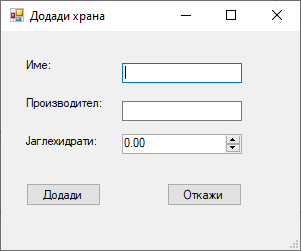

# ProjectVP-DiabetesLog
## Опис
Апликацијата претставува бележник за дијабетичари, кој им овозможува на корисниците да внесат нов запис за одреден датум и време, и прелистување на веќепостоечките записи.

### Датабаза и пристап
Апликацијата користи [SQLite](https://www.sqlite.org) embeded датабаза за запишување и читање на записите. Пристапот од/до датабазата е овозможен од [System.Data.SQLite](https://system.data.sqlite.org).

### Функционалости
1. Додавање на нов запис за одреден датум и време, кој може (но не мора) да ги содржи следните полиња:
   - **Измерена вредност на шеќер во крв (mimol/L)**
   - **Дадена доза на инсулин (во инсулински единици)**
   - **Оброк конзумиран за даденото време (листа од храна и количина)**

2. Прелистување на веќепостоечки записи, при што за зададен датум се прикажуваат:
   - **Листа од временски записи за зададено време**
   - **Листа на оброци кои се однесуваат на селектираниот временски запис**

## Упатство за користење
### 1. Избор на опции
Функционалностите кои се подржани од самата апликација

### 2. Прозорец Додади Мерење
Полињата се поделени во четири групи:
   - **Дата и време**
   - **Мерење**
   - **Инсулин**
   - **Оброк**

За секој запис полињата ***Дата*** и ***Време*** се задолжителни.
Полињата што се содржат во групите ***Мерење***, ***Инсулин*** и ***Оброк*** не се задолжителни, и нивното овозможување се одредува преку штиклирањето на CheckBox-от `Овозможи` при секоја од претходно наведените групи.

#### 2.1 Мерење
Се избира вредноста на мерењето што сакате да го додадете. Ако е штиклирано `Овозможи`, мора да се внесе вредност поголема од **нула (0)**.

#### 2.2 Инсулин
Од листата се избира *типот на инсулин* и *количината* (изразена во инсулински единици) во која бил даден истиот. Ако е штиклирано `Овозможи`, мора да се внесе количина поголема од **нула (0)**.

##### 2.2.1 Додавање нов тип на инсулин
Доколку сакате да додадете нов тип на инсулин кој го нема во листата за избор на тип на инсулин, тоа може да го направите со притискање на копчето `Додади нов тип`.
Ново отворената форма ги содржи полињата 
   - **Име на инсулин**
   - **Производител(на инсулин)** 

кои се ***задолжителни и неможат да се остават празни***.

\* ***Додавање на веќе постоечки тип на инсулин не е дозволено!*** \*

#### 2.3 Оброк
Од листата се избира *храната* која сте ја внеле при оброкот и нејзината *количина*. Откако ќе го направите претходно наведеното, со притискање на копчето `Додади оброк` се додава оброкот во листата на оброци. Доколку сакате да отстраните одреден оброк, тоа може да го направите со *селектирање на оброкот од листата на оброци* и притискање на копчето `Отстрани оброк`.

##### 2.3.1 Додавање нов тип на храна
Доколку сакате да додадете нов тип на храна во листата, тоа може да го направите притискање на копчето `Додади храна`, при што се отвара нов прозорец со истото име.
Овој прозорец содржи три полиња:
   - **Име(на храна)**
   - **Производител(Бренд)**
   - **Јаглехидрати(на 100г)**

каде што **првите две полиња се задолжителни**, а **последното поле е *опционално***.

### 3. Пребарувај мерења
Пребарувањето се извршува со избор на *дата* за која што сакате да пребарате и притискање на копчето `Пребарај`.

Во горната десна листа се прикажуваат сите *временски записи* кои се однесуваат на бараниот *датум*. Доколку не постојат такви, листата е празна.

Со избирање на секој од записите, во долната десна листа се прикажуваат сите *оброци* кои се однесуваат на избраниот *временски запис*. Доколку не постојат, листата е празна.

